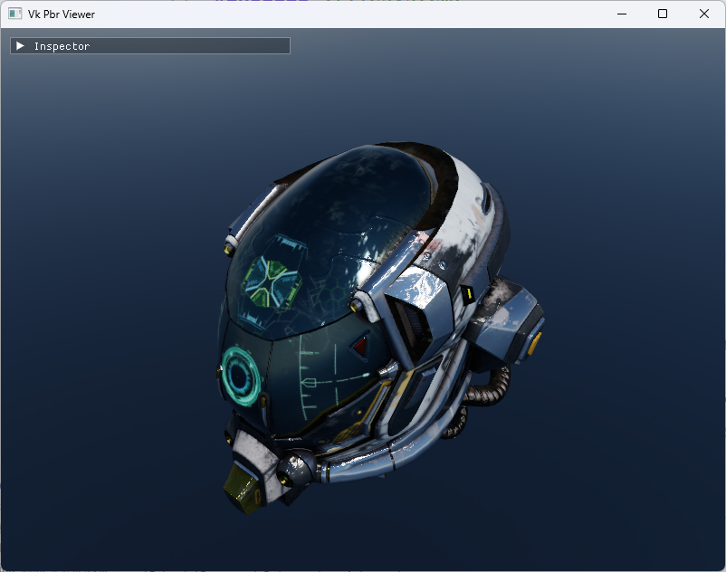
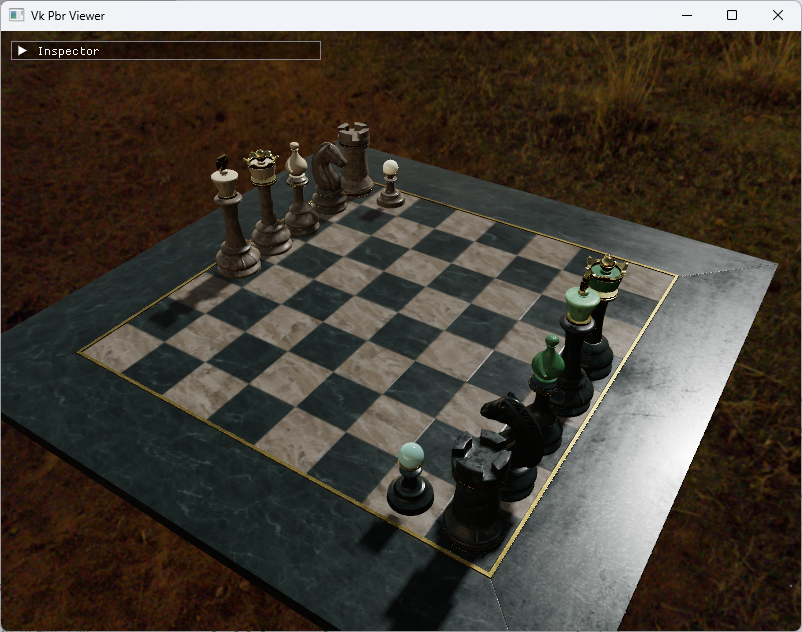

# VkPbrViewer

基于 **Vulkan 1.3** 的实时 PBR 模型查看器，使用 C++17 编写。侧重于预览与交互：加载 glTF 模型，在 Inspector 面板中实时调节材质、灯光、天空盒与后处理参数，查看 PBR 渲染结果。

|          DamagedHelmet（默认场景）           |                 ABeautifulGame                 |
| :------------------------------------------: | :--------------------------------------------: |
|  |  |

## 功能特性

### 渲染

- **PBR 材质**：Cook-Torrance BRDF（GGX），金属度/粗糙度工作流；支持 albedo / normal / metallic-roughness / AO / emissive 五组贴图，参数可手动调节或由贴图驱动
- **IBL 环境光照**：启动时用 4 个 compute shader 一次性烘焙——equirect HDR 转 cubemap、irradiance 卷积、prefilter、BRDF LUT
- **阴影**：shadow map + 硬件深度比较采样（`sampler2DShadow`）
- **后处理**：离屏 HDR 渲染 + MSAA，曝光调节 + ACES filmic 色调映射
- **模型与场景**：glTF 2.0 导入（tinygltf），多网格多物体；纹理支持 PNG / JPG / BMP / HDR（stb）
- **交互式 UI**：Dear ImGui Inspector 面板——帧率统计、环境、逐物体材质与贴图、后处理参数；支持文件对话框导入模型与贴图

### 架构与工程

- **六层架构**：core / rhi / resource / render / scene / application 单向依赖；scene 经 SceneProxy 纯数据接口与 render 解耦，RenderScene 按 object id 对账、增量更新
- **资源生命周期**：RAII 句柄 + 引用计数管理共享 GPU 资源，归零后进 Graveyard 延迟 K 帧销毁，descriptor set 回收到池复用
- **Descriptor 管理**：layout 为唯一真源并按内容去重；pool 按 layout 分组、自动扩容，Set 只复用不释放
- **动态渲染**：基于 Vulkan 1.3 dynamic rendering，无经典 RenderPass / Framebuffer，渲染 scope 间显式同步屏障
- **构建**：依赖统一 FetchContent（GIT_TAG 锁定版本），构建期自动编译 GLSL → SPIR-V

## 构建与运行

### 环境要求

- Windows 10/11（文件对话框依赖 Win32 API，其他平台该按钮不可用）
- CMake ≥ 3.21，支持 C++17 的编译器（MSVC）
- [Vulkan SDK](https://vulkan.lunarg.com/sdk/home)（提供 Vulkan loader 与 glslc 着色器编译器）
- 首次配置需联网：其余依赖（GLM / GLFW / Vulkan-Headers / tinygltf / stb / Dear ImGui）由 FetchContent 自动拉取，版本以 GIT_TAG 锁定

### 构建步骤

```bash
cmake -S . -B build
cmake --build build --config Release
```

着色器随构建自动编译，无需手动步骤。

### 启动

演示资产已随仓库提供，clone 后即可运行（默认场景加载 DamagedHelmet 与 qwantani 天空盒）。必须在**项目根目录**下启动（资源路径相对根目录），启动时若没有 `assets/` 目录会直接报错退出：

```bash
build/Release/VkPbrViewer.exe
```

## 操作方式

| 操作     | 按键                                                                 |
| -------- | -------------------------------------------------------------------- |
| 环视视角 | 按住鼠标右键拖动                                                     |
| 移动     | WASD（水平）、Q / E（升降）                                          |
| 退出     | ESC                                                                  |
| 参数调节 | 左侧 Inspector 面板（Stats / Environment / 物体材质 / Post Process） |

## 文档

| 文档                                         | 内容                                                     |
| -------------------------------------------- | -------------------------------------------------------- |
| [docs/architecture.md](docs/architecture.md) | 架构约定：分层、依赖规则、资源模型（开发规范，唯一真源） |
| [docs/data-flow.md](docs/data-flow.md)       | 数据流：一帧的生命周期、资产从文件到像素的链路、IBL 烘焙与销毁路径 |
| [docs/dev-history/](docs/dev-history/)       | 开发期文档归档：需求、项目构思、分阶段实现记录           |

计划中的文档（随开发逐步补全）：

- 架构总览（面向读者的架构介绍与设计取舍）
- 逐层文档（`docs/layers/`：core / rhi / resource / render / scene / application）

## 已知限制

- 必须从项目根目录启动（资源路径相对根目录）
- 文件对话框仅支持 Windows，其他平台导入按钮为 no-op
- glTF 仅支持纹理外置的布局：GLB 及内嵌纹理（data URI）暂不支持，遇到时会跳过该贴图（输出警告日志）
- 阴影投射范围是围绕原点的固定包围盒，盒外物体不投影
- 项目默认启用 FPS 相机控制器；轨道相机控制器（`OrbitCameraController`）已在代码中保留，可在 `app.cpp` 中注释切换

## 资产来源

仓库内的演示资产来自以下公开资源站，版权归原作者所有：

- 模型：[Khronos glTF-Sample-Assets](https://github.com/KhronosGroup/glTF-Sample-Assets)（DamagedHelmet、AntiqueCamera、ABeautifulGame、Suzanne）
- HDR 天空盒：[Poly Haven](https://polyhaven.com/)（qwantani、citrus_orchard_road、dikhololo 系列）
