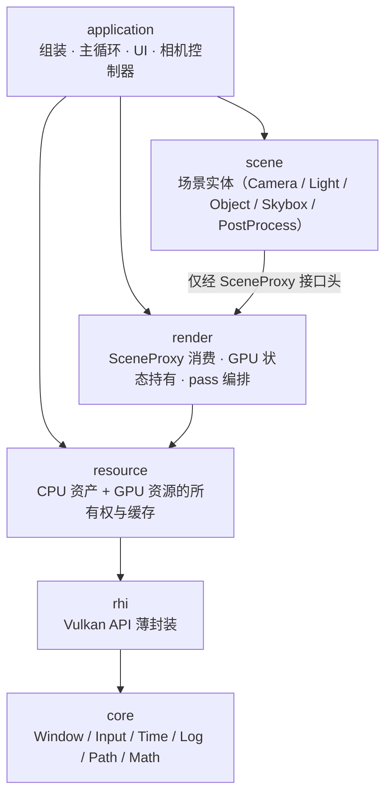

# 架构

> 面向读者的架构说明：系统怎么组织、为什么这么设计。数据怎么流动见 [data-flow.md](data-flow.md)；每一层内部的文件与机制见 [layers/](layers/)（撰写中）；开发时必须遵守的规范条目（命名、不变量、错误处理约定）见 [dev-history/architecture.md](dev-history/architecture.md)。

## 设计出发点

VkPbrViewer 是一个小型查看器，但按引擎的思路组织。三条主线贯穿全部设计：

1. **scene 与 render 严格解耦**：场景实体不含任何 Vulkan 类型；渲染层消费的是数据流，而不是场景对象。
2. **资源生命周期显式化**：CPU 资产与 GPU 资源分层管理；共享走引用计数，销毁走延迟队列，杜绝悬空。
3. **描述符与状态不重复**：同一份 layout、同一张贴图、同一组材质贴图组合，在全工程内只存在一份。

## 分层总览

| 层 | 职责（一句话） | 边界（不允许做的事） |
| --- | --- | --- |
| core | 与图形无关的基础设施 | 依赖其他任何层 |
| rhi | Vulkan API 的薄封装（L0） | 出现材质、相机等业务语义 |
| resource | CPU 资产与 GPU 资源的所有权、缓存、生命周期 | 了解场景结构 |
| render | 把数据流装配成 GPU 状态，编排 pass | include 任何 scene 层类型 |
| scene | 场景实体与业务数据 | 触碰 GPU 资源侧；持有 render 层类型 |
| application | 程序组装、主循环、UI、相机控制器 | ——（只做编排，不下沉逻辑） |

依赖规则归结为两条硬约束（完整规则与命名约定见 [dev-history/architecture.md](dev-history/architecture.md)）：

1. `core ← rhi ← resource ← render` 严格单向；
2. `scene → render` 仅通过 SceneProxy 接口头（纯数据 + 变更记录）；render 不 include 任何 scene 类型。

## 关键设计决策

### 1. scene 与 render 用数据流解耦，而不是对象引用

scene 实体把数据写进 SceneProxy（每帧输入 + 仅变化时写下的变更记录），render 层的 RenderScene 每帧消费：按 object id find-or-create、只处理增量。两层因此没有类型依赖，可以独立演化；多物体的增删改也收敛为一条数据通道。完整时序见 [data-flow.md](data-flow.md)。

### 2. 资源按 L0 / L1 / render-state 三段划分

- **L0**：Vk 句柄的薄封装（Buffer / Image / ImageView / Sampler / DescriptorSet），统一走句柄 + 延迟销毁；
- **L1**：渲染资源的组合（MeshResource / UboResource / TextureResource）；
- **render-state**：与 shader descriptor set 对应的宿主容器（FrameState / MaterialState / ObjectState / TargetTextures…），归 render 层。

动机：resource 层保持"通用资源管理"的纯粹性；"这组贴图加这个 set 组成材质"是渲染语义，不该下沉到资源层。哪些容器归哪层、怎么命名，规则见 [dev-history/architecture.md](dev-history/architecture.md)。

### 3. 共享资源用 RAII 句柄，销毁走 Graveyard

`Handle<T>` = 条目索引 + 引用计数，拷贝 +1 / 析构 -1；归零后拆解成裸 Vk 句柄进 Graveyard，K 帧后销毁；descriptor set 归零后回收到池复用。动机：GPU 异步执行中，"CPU 认为没用了"不等于"GPU 用完了"——句柄系统把"谁还在用"变成可计数的确定状态，销毁时机由 fence 推算。详见 [data-flow.md](data-flow.md) 的销毁链路，实现剖析见 [layers/resource.md](layers/resource.md)（撰写中）。

### 4. descriptor layout 是唯一真源

全部 descriptor layout 由 DescriptorManager 集中管理：按内容去重、pool 按 layout 分组持有、池满自动扩容、Set 归零后 reuse-only 回收。pass 创建管线时只查询 layout，不自行描述。动机：layout 不匹配是 Vulkan 最常见的事故源之一，收敛到唯一出处后可以整体保证一致。

### 5. GPU 材质按内容寻址共享

MaterialState = 贴图组合 + 描述集（不含标量参数），以 `MaterialDesc`（5 个贴图 slot 的 id）哈希去重；albedo 因子、metallic/roughness 等标量放在 per-object 的 UBO 里。动机：引用同一组贴图的物体共享同一份 GPU 材质，描述集数量与物体数量解耦。

### 6. Vulkan 1.3 dynamic rendering

不创建经典 RenderPass / Framebuffer，pass 用 RenderingScope RAII 描述加载/存储行为。代价是 scope 之间没有隐式依赖、同步全部显式化——本项目用每帧固定序列的 6 组 layout transition（shadow map、离屏目标三张图、交换链图像）加 2 处 scope 间 barrier（lit→skybox、post→ui）保证读写序。动机：少样板、pass 组合灵活；代价被转化为一张明确列出的屏障清单，见 [data-flow.md](data-flow.md) 的 pass 表。

## 错误处理与日志

六类场景的处置表（外部输入失败 / 可降级警告 / 代码错误 / 致命 GPU 错误 / 不变量 / 取消）与资源层日志分级，约定见 [dev-history/architecture.md](dev-history/architecture.md)。

## 文档地图

| 想了解 | 看哪里 |
| --- | --- |
| 项目是什么、怎么构建运行 | [README](../README.md) |
| 结构与设计动机（本文） | docs/architecture.md |
| 一帧、一份资产、一次销毁的完整流动 | [data-flow.md](data-flow.md) |
| 某一层内部有什么 | [layers/](layers/)（撰写中） |
| 开发规范与历史决策记录 | [dev-history/](dev-history/) |
