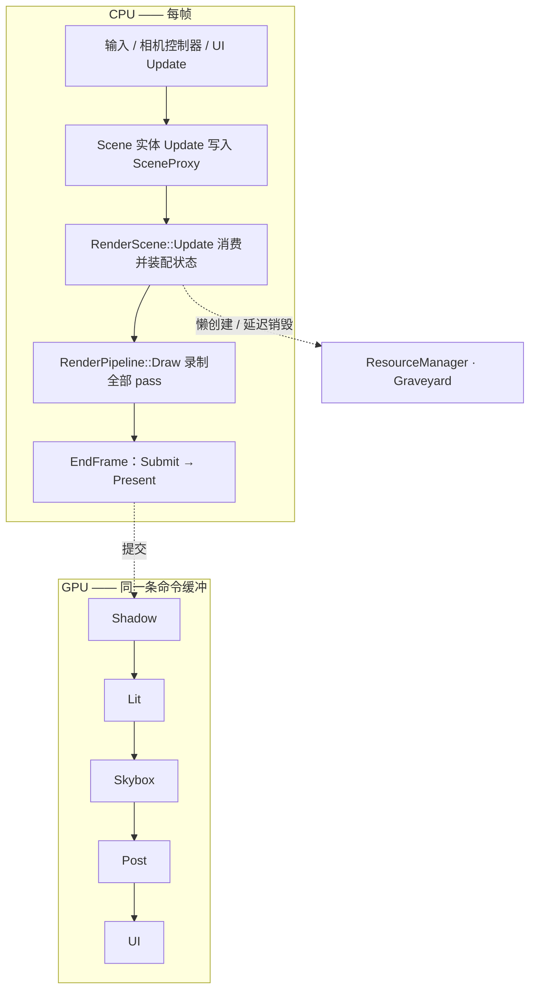
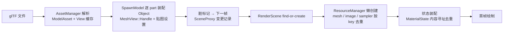

# 数据流

本文回答"数据怎么流动"。必须遵守的规则与不变量（分层、依赖、命名、句柄）以 [architecture.md](architecture.md) 为准，本文只做讲解；各层内部结构见 [layers/](layers/)（撰写中）。文件路径均相对 `src/`。

## 总览

## 一帧的生命周期

### CPU 侧：从输入到命令提交

1. **输入与相机**（`application/app.cpp`）：`PollEvents` → Input/Time 更新；右键按下时禁用光标进入 FPS 环视，`FpsCameraController` 改写 Camera 状态（WASD 平移、Q/E 升降）。
2. **UI**：ImGui NewFrame → `UI::Update()` 组装 Inspector（Stats / Environment / 物体材质 / Post Process），产生 ImGui 绘制数据。
3. **场景写入**（`scene/scene.cpp` `Scene::Update`）：
   - Camera / Light / Skybox / PostProcess 四个全局实体各自 `Update()`，把原始输入写进 SceneProxy（scene → render 的唯一通道）；
   - 物体遍历：`deletePending` → `proxy.DeleteObject(id)` 并从池中移除；否则 `Object::Update()`——**变更记录只在变化发生的那一帧写一次**（`m_meshDirty` / `ConsumeTexturesDirty()`），逐帧数据（transform + 材质参数）每帧全量写。
4. **帧提交**（`render/renderer.cpp` `DrawFrame`）：
   - `BeginFrame`（`rhi/frame_sync.cpp`）：等待本帧 fence（命令缓冲可安全复用）→ acquire 交换链图像（需重建则提前返回）→ resetFence → 重置并开始录制命令缓冲；
   - `FlushGraveyard()`：延迟销毁计时推进——**每帧都跑，重建帧也不例外**（重建本身会把旧纹理入队）；
   - `RenderScene::Update(frameInfo)`：消费 SceneProxy（见下文）；
   - `RenderPipeline::Draw(frameInfo)`：向同一条命令缓冲录制全部 pass；
   - `EndFrame`：提交（等待 imageAvailable @ COLOR_ATTACHMENT_OUTPUT，signal present 信号量，fence 归还本帧）→ Present → frameIndex 轮转。

### SceneProxy：三段式数据流（`render/scene_proxy.h`）

SceneProxy 把 scene → render 的传输拆成三个生命周期精确一帧的区域：

| 区域 | 内容 | 写入时机 | 清除时机 |
| --- | --- | --- | --- |
| 场景输入区 | CameraInput / LightInput / PostProcessInput / ObjectInput（id + transform + 材质参数） | 实体每帧全量覆盖 | `BuildSceneProxy` 转换完成后 |
| 变更记录区 | EnvironmentRecord / ObjectRecord（optional 的 meshId、textureIds）/ DeletedObjects | **仅变化发生的那一帧** | RenderScene 消费后 `Reset()` |
| 渲染输出区 | `Gpu::PerFrame` / `Gpu::PostProcess` / `ObjectData{id, PerObject}` | `BuildSceneProxy` 转换生成 | RenderScene 消费后 `Reset()` |

`BuildSceneProxy(aspect)` 负责把原始输入换算成 shader 布局：view/proj 矩阵（投影 Y 翻转适配 Vulkan）、天空盒专用 viewProj（`mat3(view)` 去掉平移）、光源方向（光位置即方向，指向原点）、`exposure = 2^EV`、逐物体 model 矩阵 + normal 矩阵（逆转置）+ 材质参数打包。

**为什么是局部 static 单例**：让 Camera/Light/Object 的 `Update()` 保持无参签名，避免把 proxy 引用层层下传到每个实体；多场景/多线程时再改为显式注入（`scene_proxy.h` 注释中的既定权衡，非疏忽）。

### RenderScene 的消费顺序（`render/render_scene.cpp`）

1. `BuildSceneProxy(aspect)` 转换原始输入；
2. `UpdateFrameState`：存在 EnvironmentRecord（换了天空盒）→ **整体重建 FrameState**（新 UBO/描述集 + 新环境图）；随后把 PerFrame 写入 UBO[frameIndex]；
3. `UpdatePostProcessState`：exposure 写入 UBO[frameIndex]；
4. `UpdateRenderObjects`：
   - 删除通道：`m_objects.Remove(id)`；
   - 变更记录：`IdVector` 的 `FindOrAdd`（不存在就 `CreateRenderObject`——先以空 mesh + fallback 材质占位，等记录到达再填充）→ meshId → `GetOrCreateMesh` / textureIds → `MaterialDesc` → `GetOrCreateMaterialState`；
   - 逐物体数据：写入各自 ObjectState 的 UBO[frameIndex]；
5. `proxy.Reset()`。

### 同步模型（`rhi/frame_sync.cpp`）

| 同步对象 | 数量 | 索引 | 生产者 → 消费者 |
| --- | --- | --- | --- |
| imageAvailable 信号量 | 2（kMaxFramesInFlight） | frameIndex | 交换链 acquire → 图形队列 submit |
| inFlight fence | 2 | frameIndex | GPU 提交完成 → CPU（BeginFrame 等待） |
| present 信号量 | 交换链图像数 | **imageIndex** | 图形队列渲染完成 → present 队列 |

> **亮点：present 信号量按 imageIndex 而非 frameIndex 索引。** 教程常见写法是 per-frame，但 present 消费的是"图像"而不是"帧"——交换链只有在图像 present 完成后才会再次 acquire 它，所以按 imageIndex 索引时，每个信号量在 present 尚未消费前绝不会收到第二次 signal，语义严格成立。这是设计之初就按生产者-消费者模型推导的结果，不是踩坑后的修补。

frames in flight = 2：CPU 最多领先 GPU 一帧。一切 per-frame 资源（命令缓冲、UBO、描述集）都双份、按 frameIndex 选取——这正是 `ObjectState` 持有 2×UBO + 2×描述集的原因。

### GPU 侧：一条命令缓冲里的五个 pass（`render/render_pipeline.cpp`）

| # | Pass | 输入 → 输出 | 关键机制 |
| --- | --- | --- | --- |
| 1 | ShadowPass | 全部 RenderObject → 2048² 深度 shadow map | 深度偏移（constant 1.25 / slope 1.75）抑制阴影痤疮；pipeline 用 Empty 布局占位 set 1/2，与 LitPass 的 set 编号对齐；投射范围是围绕原点的固定包围盒（已知取舍） |
| 2 | LitPass | RenderObjects → MSAA color + resolve + depth | **按 MaterialState id、再按 mesh id 两级排序**，记录 last id 只在变化时 bind 材质 set / 重绑顶点索引缓冲；set 0（PerFrame）与 set 1（shadow map）只绑一次 |
| 3 | barrier | — | 动态渲染 scope 之间没有隐式依赖：lit 写入须对 skybox 的 load 可见；resolve 图像上是 write-after-write；depth 转只读 |
| 4 | SkyboxPass | 天空盒 cubemap → 同一 MSAA 目标 | loadOp **LOAD** 重载 color/depth，深度只测不写，然后**再次 resolve** 进同一张 resolve 图 |
| 5 | PostProcessPass | resolve 图 → 交换链图像 | 采样 HDR 颜色 × exposure，ACES filmic 色调映射 |
| 6 | barrier | — | post 写入对 UI 的 load 可见 |
| 7 | UIPass | ImGui 绘制数据 → 交换链图像 | LOAD 叠加 |
| 8 | transition | — | 交换链图像 → PRESENT_SRC_KHR |

> **亮点：lit-first skybox（反常规 pass 顺序）。** 常规是先画天空再画物体；这里 lit 先画满，skybox 靠深度测试只填 lit 没覆盖到的像素——**天空部分零 overdraw**。代价是 lit scope 必须以 loadOp LOAD 重载 MSAA 目标、scope 间需要显式屏障、resolve 要做两次。用一点屏障复杂度换像素着色量，在 4K 大面积天空的场景下是划算的。

### 交换链重建路径

两个触发点：`BeginFrame` acquire 失败（提前返回，本帧只剩 graveyard flush）；`EndFrame` present 返回 suboptimal / error。两条路都汇到同一处：

- `RenderScene::Recreate()`：**先**创建新 TargetTextures 和依赖它的新 PostProcessState，**再**一起提交替换——保证任何存活的描述集都不引用已释放的 image view（architecture.md 重建规则的落地实例）；
- `RenderPipeline::RecreateResources()`：各 pass 重建自身依赖；
- `FlushGraveyard` 每帧照跑：重建入队的旧目标纹理依靠它销毁。

## 资产的一生：从 glTF 文件到首帧像素

1. **解析**（`resource/asset_utils.cpp`）：tinygltf 解析 `.gltf`；纹理 URI 必须外置——`data:` URI 或内嵌纹理会记警告并跳过该贴图。
2. **视图铸造**（`scene/utils.cpp` `SpawnModel`）：逐 part 铸造 `MeshView::Handle`（MeshKey = 模型路径 + part 序号）；纹理铸造 `TextureView::Handle`（TextureKey = 路径 + 类型）。同 key 自动复用缓存条目。
3. **场景装配**：每个 part 一个 `Scene::Object`：`SetMesh`（RAII Handle，拷贝 +1 / 析构 -1）+ 材质贴图设置 → 脏标记。
4. **变更下发**：下一帧 `Object::Update()` 产出 `UpdateMesh(id, meshId)` / `UpdateMaterial(id, 5 个贴图 id)` 变更记录。
5. **懒创建 GPU 资源**（`resource/resource_manager.cpp`）：`GetOrCreateMesh`（meshCache 按 ResourceId 去重，顶点/索引经 staging 一次性上传）；`CreateTexture` → `GetOrCreateImage`（**同一张贴图全工程只上传一次**）+ `GetOrCreateSampler`（SamplerDesc 哈希去重）。
6. **状态装配**：`MaterialDesc`（5 个 slot 的贴图 id）→ `CacheTable<MaterialState>` 内容寻址去重；空 slot 用 1×1 fallback 纹理填充，缺贴图不崩。
7. 首帧绘制。

**要点**：

- **Asset / View 两层访问**：Asset 是 asset 模块内部实现，对外只暴露 View 与 key；CPU 侧资产数据随 View 常驻内存，UI 直接读 View 展示资产信息，GPU 上传不触发二次文件 IO。
- **两个生命周期体系互不纠缠**：scene 层持 View 的 RAII Handle（资产生命周期唯一归属）；resource 层对 asset 只做调用内借用（`GetMesh`/`GetTexture` 返回裸指针，单次调用内用完即弃），绝不持有 asset Handle。entry 归零即擦除，stale id 查得 nullptr → 降级 fallback，不会悬空。

## IBL 烘焙链路（启动时一次；换天空盒时重烘环境图）

入口：`ResourceManager::CreateEnvironments(equirectId)` → [skybox cubemap, irradiance, prefilter]；BRDF LUT 与具体天空盒无关，全局只烘一次。四步全部走 `EnvironmentBaker` + `ComputeConversion` 的**同步 compute dispatch**（内部 OneShotCommand，每步自带到最终 layout 的转换）：

| 目标 | 尺寸 | 方法 |
| --- | --- | --- |
| skybox cubemap | 2048² ×6，全 mip 链 | equirect 直采，storage image 写入基级 mip（8×8×6 workgroup）；mip 1..N 由 blit 生成 |
| irradiance map | 32² ×6 | 卷积时采样 `log2(2048/32)` 级 mip——**先用低通杀掉太阳峰值方差**，再卷积 |
| prefilter map | 128 基级 ×6，逐 mip | 每个 mip 单独 dispatch，roughness = mip/(N-1) |
| BRDF LUT | 512² RG16F | 纯数学积分，无输入贴图 |

产出装配进 FrameState：每个 PerFrame 描述集 = UBO（binding 0）+ BRDF LUT（1）+ skybox / irradiance / prefilter（2-4）。

## 销毁链路：引用归零之后

1. `Handle<T>` 引用计数归零 → 组合资源（MeshResource / TextureResource 等）**先自行拆解**成裸 Vk 句柄（ Release ）→ 裸句柄入 Graveyard；
2. Graveyard 六类队列（memory / image / buffer / sampler / imageView / descriptorSet）：入队时 lifetime = kMaxFramesInFlight(2)，每帧 waitFence 后 `Flush()` 减一，归零销毁；
3. **为什么 K=2**：死亡帧的提交完成由"第 K 次 flush 时观察到的 fence"证明——2 帧后销毁，绝不早于 GPU 用完它；
4. **销毁顺序即依赖序**：视图/采样器先死，memory 最后（vkFreeMemory 要求没有存活的绑定资源）；descriptor set 不销毁，走 `DescriptorManager::Recycle` 回到所属池的 free list 复用（reuse-only，不调 vkFreeDescriptorSets）。
